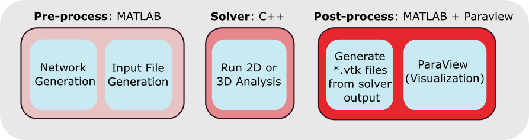
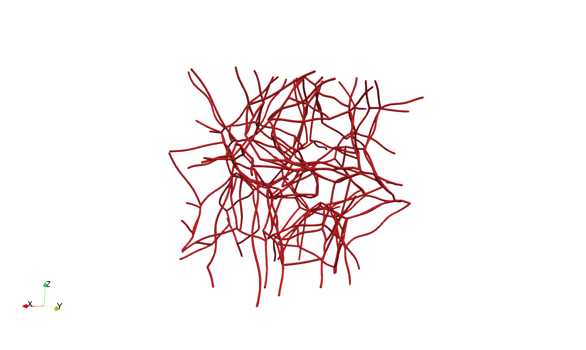

# isofin
Isogeometric Fiber Networks Simulation tool. A complete pipeline to pre-process, solve and post-process random fiber networks using Isogeometric Analysis.


## Requirements

* Matlab: pre-processing and data analysis
* Paraview: post-processing and visualization
* C++ Standard Libraries
* OpenMP: library for parallel programming, required by our solver

## Overview



The following is a guide to using Isofin. MATLAB scripts are used to generate networks, input files, and mesh files. The input files and mesh files are used in the C++ code to run a nonlinear finite element simulation with isogeometric beams. Then, the results output from this C++ code are analyzed using MATLAB scripts, and converted into a form readable by Paraview. Detailed steps are given below, along with relevant information.

## Creating a fiber network
1.	Navigate to “isofin/Matlab/Network Generation/”. "Voronoi_Network_Generator_3D.m" will create a 3D fiber network of straight fibers. Additionally, we have shared the networks used in our paper under "Example Networks/". The following code will describe how to use these networks, or any network of your own, in our analysis pipeline. To use your own 3D networksm, you must abide by the following data formatting. Your fiber network must be stored in an array named "Segment" of size (num_fibers,6). Each row corresponds to a different fiber. The first three columns of a row give the coordinates of the fiber's first node, and the latter three columns give the coordinates of the fiber's other node. Additionally, you must generate a variable named "Junction" that gives the locations of each fiber junction. We define a junction as any node shared by two or more fibers. To create the Junction variable, start with the following line to get all unique node values from Segment
```matlab
Junction = unique([Segment(:,1:3);Segment(:,4:6)],'rows');
```
a.  Then you must remove all nodes from Junctions that are not shared between fibers. These nodes only occur in one fiber, and must be removed from our Junctions variable. To do this, you may use the following functions (both of which are included in our repository):
```matlab
function [Segment,Junction,junction_number] = adjust_network(Segment,Junction)    
    % Find how many fibers are coming out each Junction
    junction_number = how_many_fibers(Segment,Junction);    
    % Remove junctions that have 1 or 0 fibers
    one_ind = junction_number == 1;
    Junction(one_ind,:) = [];
    % Get new junction_number for debugging purposes if desired
    junction_number = how_many_fibers(Segment,Junction);
end

function junction_number = how_many_fibers(Segment,Junction)
    junction_number = zeros(size(Junction,1),1);
        for ii = 1:length(junction_number)
            temp = Junction(ii,1:3);
            check_one = sum(temp == Segment(:,1:3),2);
            check_two = sum(temp == Segment(:,4:6),2);
            % Gets how many fibers come out of said junction
            junction_number(ii) = sum(floor(check_one/3) + floor(check_two/3));
        end
end
```
b.  We also reccomend removing fibers smaller than your chosen element size. In our pipeline, small fibers are removed in "Voronoi_Network_Generator_3D.m", along with removing stray fibers that are disconeccted from the rest of the network. Removing stray fibers is not necessary, but removing small fibers helps with convergence.

c.  After creating the Segment and Junction variables with the proper format, you may proceed to use your own networks in our pipeline. Here, we must note that our code is suitable for unit cube domains only, but this can easily be modified in the C++ function, "RN_3D_BC_SimpleShear.cpp". You will have to recompile the C++ code if you do this though. Future updates will make it so the domain is automatically determined, rather than built into the code.

2.	If you are using a straight fiber network, proceed to the next step. If you wish to use an undulated fiber network, you will need to use “Undulating_Networks.m”. Here, you may adjust the period to modify the undulations of the network. Be sure to properly set num_fibers and Case to match the network you want to add undulations to.

## Creating input and mesh files
1.	Navigate to “isofin/Matlab/Input File Generation/”. The file “Input_File_Generation.m” will turn the networks created in the previous step into input and mesh files suitable for analysis in our C++ code. Here, you will set the type of network you are using, deformation mode of the network, and which fiber network you will use. 
a.	In regards to the network type, our scripts can handle 2D and 3D networks, but you will need to generate your own Voronoi networks to generate 2D input and mesh files.
b.	Within this script, you have control over the element size, the order of NURBS functions, and network parameters for the trimming of fibers and insertion of control points for the bending strips.
c.	We have built into the code uniaxial stretching, biaxial stretching, simple shear, and an idealized pure shear cube. However, you may adjust the BCs as desired. You can apply displacement or force BCs. You can control the number of threads on which to run the simulation, the number of increments you want, the max number of iterations per increment, the max number of attempts per increment, and convergence criterion.
d.	Make note of where you save your input and mesh files. We opt for saving them in “isofin/Input_files” and “isofin/Mesh_files”. You will need to adjust the paths in the C++ codes to find the files if you want to organize your files differently.

## Running simulations  
1.	Within “isofin/Main/” are three C++ files. “RN_2D_Trial_UATX.cpp” is for any 2D networks you generate, while “RN_3D_Debug.cpp” and “RN_3D_Trial_UATX.cpp” are for any 3D networks you generate. To compile the code, please use the following command using “RN_3D_Trial_UATX.cpp” as an example:
a.	 “<compiler> RN_3D_Trial_UATX.cpp -o Analysis_3D -O3 -fopenmp -std=c++17”
b.	We recommend using a C++ standard no newer than C++17, as newer standards will cause the Eigen library to generate warnings. We cannot guarantee convergence of the simulations with newer C++ standards either. 
c.	The results files will be stored in “isofin/Results/Outputs/3D” (or 2D if running a 2D network), unless otherwise changed. This is the directory in which the scripts in “isofin/Matlab/Output Generation” will look for the results.

## Generating Paraview compatible output files
1.	In “isofin/Matlab/Output Generation/”, there are two scripts, one for generating *.vtk files for straight networks, and one for undulated networks. They are named accordingly, “Paraview_VTK_Generator_Line_3D_Straight.m” generated *vtk’s for straight fiber networks, and “Paraview_VTK_Generator_Line_3D_Undulated.m” generate *vtk’s for undulated fiber networks. Note that a *vtk file will be generated for each increment in the simulation. The script also calculates the energy and energy ratios for the fibers in the network. After running one of these scripts, you will have *.vtk files for your simulation, and may perform further analyses on your results.

## Tutorial - 3D Networks

We will split this tutorial into four steps as listed above. First, we will create a fiber network using "Voronoi_Network_Generator_3D.m". If you wish, you may also use an example 3D fiber network found in "Matlab/Example Networks/Data/3D/Undulated/60/". First, we will navigate to "Matlab/Network Generation/" and open "Voronoi_Network_Generator_3D.m". This script generates a fiber network from randomly generated voronoi seeds. It can be used to create networks with connectivity values, $z$, within the range of natural biopolymers, $z\in [3,4]$. This algorithm can only generate cube networks. We will create a network that was used in our paper. We set the following parameters:

```matlab
nseeds = 60;
z_target = 3.4;
CO_length = 0.01;
round_off_edge_tol = 1e-2;
```
We will create eleven networks, but we will only work with one of them for this tutorial. For the biaxial portion of our work, we used networks 2, 4, and 11 generated from this run. We will work with network 2 for the remainder of this tutorial, which has been saved as Case2.mat in "Matlab/Networks/Data/3D/Straight/60/' and "Matlab/Networks/Data/3D/Undulated/60/'.  


Next, we will apply an undulation to this networks. We will use the following parameters for our undulated network. Remember to specify the correct value for "Case". Here, we will use Case2.
```matlab
% Specifiy network
% Set num_fibers to be the same as nseed
num_fibers = 60;
Case=2;
New_Case=1;
% Row vector containing periods of sin undulations that can be introduced in the fiber.
period = [0.5,1,1.5,2];
num_periods=size(period,2);
% Row vector used to select periods in local y and z that a fiber can take
% based on its length. The longer the fiber, the more options it has.
select_period=[0,0.1,0.2,0.4]; 
```
This will then create "Case2_1.m", which we will use in our next step to generate input files.

Now, we will proceed to create input and mesh files for our analysis. Within "Matlab/Input File Generation/" is "Input_File_Generation.m" which creates the files necessary to run an analysis. We will use the following parameters to pick the network we just created:
```matlab
type=2; % 1 for 3D straight and 2 for 3D undulated and 3 for 2D straight
fiber_num=60;
Case=2;
New_Case=1;
% deformation_types are SSX for simple shear, UAX for uniaxial, and BIAX for biaxial.
% You can adjust these as desired.
deformation_type = 'BIAX';
```
It is important that you select the correct "type" of network you are using. Here, we are using a 3D undulated network, so we set "type=2". Also notice that we are using a biaxial tension deformation mode for this example. We will discuss our boundary conditions shortly. We will use the following parameters in generating our NURBS mesh:
```matlab
%% Mesh File parameters
ele_size=0.4/(2^power);
MS=strcat('_MS',num2str(power));
order=5;
trim_factor=0.01;
Amp=0.025;
```
We use the following material properties and boundary conditions for this example:
```matlab
% Material Properties
r=0.001;E=10^6;v=0.2;
% Boundary conditions
Max_Disp=0.5;
% Big number to identify unassigned displacement dofs.
u0=10^10;
% Displacement BC - can switch what faces BCs are applied to as needed
Face_D(1,:)=[Max_Disp,0,0,0]; % Face 1 (x=1)
Face_D(2,:)=[0,0,0,0]; % Face 2 (x=0)
Face_D(3,:)=[u0,u0,u0,u0]; % Face 3 (y=1)
Face_D(4,:)=[u0,u0,u0,u0]; % Face 4 (y=0)
Face_D(5,:)=[0,0,Max_Disp,0]; % Face 5 (z=1)
Face_D(6,:)=[0,0,0,0]; % Face 6 (z=0)

% Force BC
Face_F(1,:)=[0,0,0,0];% Face 1 (x=1)
Face_F(2,:)=[0,0,0,0]; % Face 2 (x=0)
Face_F(3,:)=[0,0,0,0]; % Face 3 (y=1)
Face_F(4,:)=[0,0,0,0]; % Face 4 (y=0)
Face_F(5,:)=[0,0,0,0]; % Face 5 (z=1)
Face_F(6,:)=[0,0,0,0]; % Face 6 (z=0)
```
Note that there is a switch condition (not shown above) within our code to switch the displacement boundary conditions based on the desired deforamtion. We implemented this to make switching between common deformation modes easier. Next, we set our solver parameters. The workstation we will run our analysis on has 24 threads available for analysis, so we will set "num_threads=24".
```matlab
% Analysis parameters
num_threads=24; % No of cores requested for analysis
num_inc=100; % No of increments.
max_numiter=125; % Max no of iterations per increment
max_attempts=5; % Max attempts per increment. (applied displacement halved per attempt)
tol_D=10^-2;tol_R=5*10^-3; % tolerence for displacement and residue criterion.
```
Once we have set these parameters, we can run the script to generate our mesh and input files. We save our input and mesh files in "isofin/Input Files/" and "isofin/Mesh Files/", respectively. You may store your files in different directories - just be sure that you update the analysis scripts to reflect these file locations. Here, we would like to note that in some simulations, convergence is better achieved by using fewer num_inc and/or a high max_numiter. We encourage playing with the analysis parameters if you cannot achieve convergence with your network.

After that, you are ready to run the analysis. The *.cpp files we need for the ananlysis are found in "isofin/Main/". Since we are using a 3D network, we need to use "RN_3D_Trial_UATX.cpp". Before compiling, be sure your "InputFileDir" and "MeshFileDir" contain your input and mesh files, respectively, and be sure to create a folder to store your results in. Finally, ensure you have a C++ compiler, the C++ Standard Libraries, and OpenMP on your machine. We will use the following terminal command to compile this *.cpp file:
```
g++ RN_3D_Trial_UATX.cpp -o Analysis_3D -O3 -fopenmp -std=c++17
```
Once compiled, we will run "Analysis_3D.exe". It will ask us to input the name of our input file, which is "input_U_BIAX_60_Case2_1_P5_MS4.txt". From there, the analysis begins. Here we would like to note: if your first strain increment is -nan%, the paths to your input and mesh files are incorrect. The analysis will take some time; on our machine, it took 48 minutes with 24 cores. The results files were saved in "isofin/Results/Outputs/3D/". Next, we will turn these results files into *.vtk files and view them in ParaView.

For our final step, we will navigate to "isofin/Matlab/Output Generation/". Because we created an undulated network, we will use "Paraview_VTK_Generator_Line_3D_Undulated.m". Be sure to select the correct deformation, fiber number, Case numbers, and network parameters for your network. Here, we use the following:
```matlab
% Select deformation type for results
deformation_type = 'BIAX';
% Select fiber number and case numbers for files
fiber_num=60; Case=2; New_Case=1; 

% Assign other parameters the same as in "Input_File_Generation.m"
power=4; ele_size=0.4/(2^(power));
order=5; end_cpt_factor=1/5; trim_factor=0.01; Amp=0.025;
```
Be sure you are using the correct directories for your network geometry and results files. This script will create a directory to store your newly created *.vtk files; you can adjust this to control where your *.vtk files are saved. After this script runs, you will have a *.vtk file for each increment in the simulation. If you wish to have less files output, than adjust the "num_increments" variable in the following section:
```matlab
% Group each increment into an individual cell 
num_increments = size(CPTS,1)/4;
CPTS_cell = cell(num_increments);
for i=1:num_increments
    CPTS_cell{i}=CPTS(4*(i-1)+1:4*(i-1)+4,:);
end
```
Next, you can open your results in ParaView. The following variables are output: 
1) E: Membrane strain
2) R1-R3: Rotations about the X,Y, and Z axes
3) U1-U3: Displacements in the X,Y and Z directions
4) Tube Normals: Normal vectors of each beam element
5) be: Bending energy
6) me: Membrane energy
7) se: Shear energy
8) te: Torsion energy

You can also analyze these variables to, for instance, understand how energy ratios change throughout the deformation for a given loading and type of fiber network. To analyze the energies of your network, we will first run "Plot_Results.m" which will save the force and displacement data from our simulations. Here, set the correct fiber_num, type, and deformation_type to plot the force-displacment curves and save the data in "forcedisp/". Then, run "Energy_Calculation.m". This script will plot the total energies and energy ratios of your network, and it will save them in the folder "energy/". 

## Troubleshoot
Thank you for using Isofin! For any inquiries, additional help, customization, or any other problems/concerns/suggestions, please reach out to us via email.
The authors of these codes are Soham Mane (sohammane@utexas.edu) and Matthew J Lohr (mlohr@utexas.edu). Matthew J Lohr and Sotiris Kakaletsis (kakalets@utexas.edu) edited the codes, prepared them for sharing, and created this documentation.
